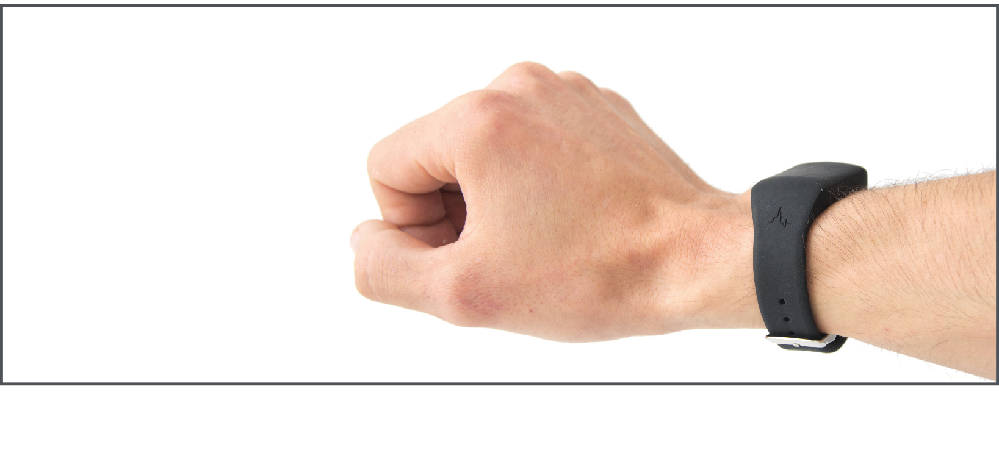

```{r setup, include=FALSE}
knitr::opts_chunk$set(echo = TRUE)
```


```{r logo,fig.align='center', echo=FALSE}
knitr::include_graphics("images/logo_questionnaire_hi.png")
```

<br><br> <!-- Add two line breaks -->

##  Research Study Information Sheets
&nbsp;

###  Study Overview
Thank you for your interest in our research study. Please read this information sheet carefully and discuss it with your family if you wish. Take your time to read it and don’t feel under any pressure to decide right away. It is important for you to understand the study fully before you decide to participate or not. If anything is unclear to you, or if you have any questions at all about the study, please don’t hesitate to get in touch with us by email (familysleeps@mu.ie).

&nbsp;

#### Why are we doing this research study?
Circadian rhythms are bodily and behavioural changes that follow a 24-hour cycle. Circadian rhythms regulate important biological processes in our bodies, such as sleep. Neurodevelopmental conditions are a group of conditions that affect the brain.  Disturbed circadian rhythms and sleep are a feature of many neurodevelopmental conditions in adults and children. Our overall aim at the Family Genomics research group at Maynooth University is to investigate the reasons for this.

In order to do this work, we first need to measure sleep and circadian rhythms in families with autistic children and in families with non-autistic children. This will help us to understand if there are any differences in sleep patterns and circadian rhythms between families with autistic children and families with non-autistic children. We will also get saliva samples from each family member to look at your genes in order to understand the link between your genes, autism, sleep and circadian rhythms.

The overall aim of this study is to investigate the link between sleep, circadian rhythms and genetics in 30 families with autistic children and 30 families with non-autistic children.

&nbsp;

####  Why am I being asked to take part in this research study? 
We have asked you to take part because you are a parent of at least two non-autistic children aged 6-10 years old or you are a parent of at least one non-autistic child aged 6-10 years old and one autistic child aged 6-10 years old, and because you are willing to help us to investigate sleep and circadian rhythms in families.

<br>

####  Do I have to take part? 
It is important to know that you, your family, and your children do not have to take part in this study if you do not wish to. You and/or your children can change your minds about participating in this study at any time, even after the study has begun. If you and/or your children decide that you do not want to participate, this will have no effect on your or their current or future participation in any other research studies. You and/or your children do not have to provide a reason for deciding not to participate or changing your mind. If you or your child wish to opt out at any point, please contact Dr Lorna Lopez (Study email: familysleeps@mu.ie), the lead investigator of this study and she will be able to organise this for you.

&nbsp;

####  Is there any reason that I might  not be eligible to participate?
We have a list of reasons why some families might not be eligible to participate in this particular study. These reasons are listed at the end of this document. Please take time to read through them. Whether or not you decide or are eligible to participate, we really appreciate each family's interest and the time you have taken to engage with us.

&nbsp;

####  Is it okay to opt out of some parts of the study? 
We need participants to complete all parts of the study so if you or your child are not happy with everything then you will not be eligible to participate.  We are happy to discuss any concerns or queries that you may have before you agree to participate.

&nbsp;

####  How will the study be carried out? 
We will give you a research kit that includes written instructions and all materials and equipment needed to complete the study and we will always be available to answer any questions you have about the study.

You will be asked to do the following tasks:

1. Put a wrist-worn activity monitor on each parent and two children (this will be worn day and night) and supervise wear for 2 weeks every 3 months, so 4 times during the study.  We will ask you to remove your child’s wrist-worn activity monitor before coming into contact with water, such as when bathing or swimming, and put it back on as soon as possible afterwards. This will be easy to remove and replace as necessary. The device will monitor movement continuously throughout the day and night. The device will only monitor movement. Below is an example of the wrist-worn activity monitor each family member will wear for 2 weeks in months 3, 6, 9 and 12.


```{r watch, fig.align='center',echo=FALSE}

```

<br><br> <!-- Add two line breaks -->


2. Put sensors that monitor movement in your children’s bedroom(s) for 12 months. A parent or caregiver will be asked to fit this sensor in the child’s bedroom. Below is an example of the sensor that will be placed in each child’s bedroom. If you require assistance with the watch or the installation of the bedside sensor at any stage, you can contact the team at familysleeps@mu.ie or 087 1998589. This sensor will also collect information about your child’s sleep environment, e.g., light, air quality and temperature, noise.  If you and your child go on holiday or stay somewhere else overnight, we will ask you to bring their bedside sensor, if possible.


```{r somnofy, fig.align='center',echo=FALSE}
knitr::include_graphics("images/somnofy.png")
```

<br><br> <!-- Add two line breaks -->


#.	Complete some questionnaires about you and your children’s sleep and sleep preferences. Only parents/guardians will complete these questionnaires. No children will ever be asked to complete questionnaires. Five questionnaires will be completed at baseline, and then three at four time points during the 12-month study (nineteen questionnaires completed over the 12 months). Questionnaires will take approximately 15 minutes each to complete.  Sleep diaries will be filled in every day for each two-week period that you are wearing the wrist-worn monitor.

#.	Provide a saliva sample for each parent and two children and return them to us using a method of your choice that we will pay for. Full instruction will be included in the saliva collection kits that we will post to you and if you require any additional assistance, you can contact the team at familysleeps@mu.ie or 087 199 8589. These samples will be used to examine each family members DNA. Each person’s DNA contains information about their unique genetic code. We will collect and analyse each family member’s unique genetic information to research within and between families for genetic links between different traits and health-related characteristics such as family-relatedness (sibling), sex, chronotype (certain times they prefer to sleep or are more alert) and autism.

#.	Provide a report that verifies your child’s clinical diagnosis of autism if this is applicable to your family. This only applies to families with a child with a clinical diagnosis of autism. The details of this report will be kept entirely confidential and securely stored in a password protected folder in Maynooth University. Only members of our research team will have access to the details of this report. The report will be reviewed by a member of our team who is an experienced clinician, who will verify your child’s clinical diagnosis.

#.	Return the sensors (wrist worn activity monitor and bedside sensor) to us using a method of your choice that we will pay for.

Your child will be asked to:

#.	Wear a wrist worn activity monitor for two weeks at four timepoints over one year (3,6,9, and 12 months). 
#.	Assent to the placement of the sensor in their bedroom for one year. 
#.	Give a saliva sample for the purpose of DNA extraction.

&nbsp;

####  What will happen to me if I agree to take part? 
After you have read this information sheet, and if you decide that the study is something you and your family would still be interested in, we will have a short conversation over the phone to ensure that you and your family are eligible to participate.  We will then ask you to give written consent to participate by post or email and then we will arrange times and methods for us to deliver the sensors and saliva kits. These can be at times and places that are convenient for you. Participation may involve online or face-to-face meetings or written correspondence in accordance with your preference.  You will have the names and contact details of the researchers who you can contact at any time during the study, should you have any questions. We will contact you again by a method of your choice to collect the questionnaire data that you have completed. We will give you clear written and/or verbal instructions on how to fit the sensors and perform the other tests, and we encourage you to contact us at any time with questions.

&nbsp;

####  Are there any benefits to me or my family if I take part in the study? 
There will be no direct benefit from participating in this research. Taking part will help us to understand more about the relationship between sleep and circadian rhythms and genetics in families. We will not feedback any of your family’s individual results for any part of the study.  We will post your child some stickers at the end of every month to thank them for their continued help with our research.

&nbsp;

####  Will I be given any results of my sleep studies?
Unfortunately, we can’t give you the results of any of the tests we do to measure sleep in you or in your children.  Knowing these measurements might unconsciously affect your own sleep and your child’s sleep.  This could then affect the results of our study, and we might end up making an incorrect conclusion.  However, we will show you data on sleep from children in general, if you are interested.  You will also be able to see summary data when we publish our results, but it will not be possible to identify the data that relates to your child.

&nbsp;

####  Are there any risks to me or others if I take part in the study? 	 
We have taken great care to identify and address any potential safety concerns, and we do not consider that taking part presents a risk to the participants.  There is a small possibility that you or your child might develop skin irritation from the wrist worn activity monitor, and we will ask you to be vigilant to this, and to remove the strap immediately if signs of irritation are detected. If you are unsure about anything, please feel free to contact our research team at familysleeps@mu.ie or 087 199 8589.

&nbsp;

####  What information about me will be used as part of this study? 
With your consent, when we enrol you in the study, we will record your name, age, date of birth (DOB), sex, address, and contact details (email and phone number). We will use your contact details to contact you about the research study, and not for any other reason. We will record your child’s name, sex, age (DOB), and clinical diagnosis (if applicable). 

For families with an autistic child, we will ask you to provide a clinical report from a psychiatrist or psychologist to confirm your child’s diagnosis of autism. We will keep a copy of this report for the purpose of clinical verification by a member of the team that is an experienced clinician.  Following verification and study completion, we will destroy this stored report. However, we will retain your child’s clinical information e.g., confirmed diagnosis of autism. This information will be retained in pseudonymised form – we will not be able to link it back to your child’s name or your family’s details. 

As soon as you and your family have enrolled in the study, you will be assigned a unique study ID code - this is called pseudonymisation. Any information we gather from that point (sensor data, genetic data and questionnaire data) will be associated with the ID code and not with your names. This is not only for electronically stored data. For example, physical copies of questionnaires, and the saliva sample each family member provides for DNA analysis will be labelled with your unique study IDs and not your names. Only the authorised research team at Maynooth University will have access to the ‘key’ that links your name to your ID code, and this information will be stored on an encrypted file on a password protected computer at Maynooth University. Neither your name nor ID code will be used when reporting the results of this research for publication or presentation; your contribution will be entirely anonymous.

Over the 12 months we will record questionnaire data for your family at four timepoints, we will record daily movement data for each family member using the wrist worn activity monitors, we will record movement and sleep data in each child’s bedroom using the bedside sensor, and we will record genetic data for each family member using the saliva samples you provide. The purpose of collecting this data is to help us to better understand the link between sleep, circadian rhythms and genes in families.

&nbsp;


####  What will happen to my personal data? 
Some of the data FamilySleeps collects from participants is considered **special category data** under 
General Data Protection Regulation, since it is classed as genetic data. Because this data can be 
linked to your identity it is considered particularly sensitive and should therefore be treated as high-risk data. This means we must meet certain requirements in order to process your data safely. In line 
with these requirements, we will be asking for your explicit consent to use your data in the ways 
outlined in this information sheet. In order for you to provide us with explicit consent, **please read 
all of this information sheet** so that you can decide whether you are happy with how we would use 
your data.


The personal information that we will collect are your name, age (DOB), sex, address and contact details (phone number and email address), sensor data, and genetic data. Your name, age (DOB), address and contact details will be stored on an encrypted file on a password protected computer at Maynooth University that can only be accessed by the research team at Maynooth University. All other data will be stored on separate encrypted files on a password protected computer at Maynooth University and will be linked to your family's unique study ID and not your names. These data files will only be accessible by the research team in Maynooth University.

We will use your Eircode to identify your small area ID of your home in order to assess your socioeconomic position.  We will link your Eircode to the Pobal HP Deprivation index, which is scale developed by the government to categorise the affluence of regions of the Republic of Ireland.  We will use this information test known associations between sleep and social deprivation.  The small area ID cannot identify your actual address just the region in which you live, and we will not store your Eircode in our research dataset – this will only be stored for the purposes of contacting you. 

Your child’s pseudonymised (not linked to their or your name or contact details) date of birth, sex and sensor data will be shared with a third-party service provider (Vital Things) during the study. They will never have access to your or your child’s name, address or contact information. This information will be used to calculate your child’s movement and sleep over the 12 months of the study. Vital Things will not share this information with anyone outside of the research team. Following completion of the study, they will destroy your child’s sensor information, sex and age. We will store this data for 10 years after completion of the study indefinitely in Maynooth University so that it can be used in future research and/or for teaching purposes (for example, student projects). Future use of the FamilySleeps data will be restricted to members of the Family Genomics Team in MU and all future research will be in line with the goals of the FamilySleeps project - to investigate the link between sleep, circadian rhythms 
and genetics in autistic and non-autistic children.

The pseudonymised questionnaire data (not linked to your name or contact details) will be shared with a third-party service provider (onlinesurveys.ac.uk) during the study. They will never have access to your or your child’s name, address or contact information.  In relation to your questionnaire data. Onlinesurveys.ac.uk will have access to your and your child’s names only in relation to any consent or assent forms completed on this platform. All survey data will be retained and hosted on a third-party (Online Surveys) server and not an Maynooth University server. 

The pseudonymised saliva samples each family member provides will be sent to a university approved third-party service provider for DNA extraction. This extracted DNA will then be sent to another university approved third-party service provider, where they will analyse your DNA. No genetic information resulting from this analysis will be shared with anyone outside of the research team at Maynooth University. All saliva samples and DNA samples will be destroyed by incineration following analysis. The third-party service providers conducting the DNA extraction and DNA analysis will not have access to your name, address or contact information but we will send them the biological sex of each person that provided a sample.

Your personal information (name, age, sex, clinical information, address, contact details) will be stored in Maynooth University for 10 years after completion of the study. After which point we will re-contact you (with your permission) to request permission to continue to store your data. All other data (sensor, genetic, and questionnaire data) will be stored in pseudonymised form (this data will only be labelled with a unique study ID, with none of your personal information, like your name or contact details, attached). This protects your privacy and reduces the risk of anyone identifying participants when handling data. This pseudonymised data will be held in Maynooth University for 10 years after completion of the study where it can be used for teaching and learning purposes or future research. Only authorised researchers on the Family Genomics team in Maynooth University will be able to access and perform analyses on your data.

If you choose to withdraw before the anonymisation processes, we will remove all of your data, where possible, from the study, including your sensor, genetic and questionnaire data. Electronic copies of data will be overwritten, and hard copies will be destroyed by incineration. Biological samples will be destroyed by incineration.

&nbsp;


####  What kind of DNA analysis will be done as part of this study?
Our goal is to uncover genetic links between neurodevelopmental conditions, sleep and circadian rhythms. We will use a method called genome-wide genotyping to examine millions of DNA variations in each research participant. This will help us to do an analysis called a Genome-Wide Association Study (GWAS), allowing us to compare these variations both within families and between different families. While this technique helps us understand these genetic links on a broader level, it does not provide insights at the level of individual research participants or specific families.

&nbsp;


####  Who will access my personal data as part of this study? 
Only the authorised researchers named above, working in the research team at Maynooth University will have access to your identifiable personal data including your address, and contact details.  All other data (sensor data, age, sex, clinical information, and genetic data) are only identifiable by your family’s unique study ID. We will never label your questionnaires, saliva samples or sensor data with your names. Onlinesurveys.ac.uk will have access to your and your child’s name in relation to your consent and assent form only, never in relation your questionnaire data. 

Your child's DOB, sex and sensor data will be shared with a third-party service provider (Vital Things). They will use this information to calculate your child’s movement, sleep and circadian rhythms over the 12 months of the study. The third-party service provider will not share this data with anyone outside of the research team in Maynooth University.

Third party processors will also carry out DNA extraction from the saliva samples and will analyse the genetic information contained in each DNA sample. We will update you when this supplier is selected via our study webpage 
(https://www.familygenomics.maynoothuniversity.ie/family-sleeps). They will not share this information with anyone outside of the research team at Maynooth University. They will not retain this information following analysis.

Third party processors will collect consent and assent forms and questionnaire data (onlinesurveys.ac.uk) and sensor data (VitalThings) but they will not share this information with anyone outside of the research team at Maynooth University. They will not retain this information following analysis. All survey data will be retained and hosted on a third-party (Online Surveys) server and not an Maynooth University server 

&nbsp;

####  Will my personal data be kept confidential? 
Your personal information will be kept entirely confidential, and we will exercise our duties in handling your personal data as per the General Data Protection Regulation (GDPR).

&nbsp;

####  How will my privacy and my child’s privacy be protected? 
Protecting your privacy is extremely important to all the research team members at Maynooth University. Personal Identifiers, such as your name or email are never used to label your questionnaires, sensor data or saliva samples. All data will be stored on password protected files on a secure network in Maynooth University. No one outside of the research team in Maynooth University will have access to your contact information and all other data will be labelled with your unique study ID.

Although all measures will be taken to protect your privacy, there is a remote risk that a connection to your contact details could be made, e.g., through unauthorised access to servers at Maynooth University. To minimise this risk, any files containing these data are password protected and have restricted access. Any attempt to identify you in this manner would be a legal breach against the permitted use of the research data.

When you have returned the sensors, questionnaires, and samples, and the study is complete, your contact details will be incinerated in the case of written records, and electronic data will be reformatted or overwritten by the research team at Maynooth University and all data will be pseudonymised (no longer linked back to your name or contact details).

&nbsp;

####  Will my personal data and/or sensor data be used in future studies?  
The data we collect will be pseudonymised to reduce the likelihood of anyone, including the research team identifying the participants from the datasets. With your consent, we will retain these pseudonymised datasets for 10 years after completion of the study. These datasets may be used in teaching or future research. Only authorised researchers on the Family Genomics team will be able to access and perform analyses on your data.

&nbsp;

####  What if my child won’t wear the wrist worn sensor?
If your child is not happy to wear a wrist worn sensor you will not be eligible to participate.

&nbsp;

####  What if you miss a day?
If you miss a day of wearing the sensor, or of using the bedroom sensor, please just continue as normal as soon as possible.  If you miss more than 2 days, then please let us know.

&nbsp;

####  What is the lawful basis to use my personal data?  
As part of the study you/your child’s personal data will only be used for scientific research which is in the public interests (Article 6 (e) and Article 9( 2) (j) of General Data Protection Regulation (GDPR)).

&nbsp;

####  What are my rights? 
Under the GDPR, you are entitled to:

*  The right to access to your data and receive a copy of it.
*  The right to restrict or object to processing of your data.
*  The right to object to any further processing of the information we hold about you (except where it is de-identified). 
*  The right to have inaccurate information about you corrected or deleted. 
*  The right to receive your data in a portable format and to have it transferred to another data controller. 
*  The right to request deletion of your data.

You can exercise these rights by contacting your study researcher (familysleeps@mu.ie) or the Maynooth University Data  Protection Officer (dataprotection@mu.ie).

It must be recognized that, in some circumstances, confidentiality of research data and records may be overridden by courts in the event of litigation or in the course of investigation by lawful authority. In such circumstances the University will take all reasonable steps within law to ensure that confidentiality is maintained to the greatest possible extent.

&nbsp;

####  Will I be given the results of the study at the end?
The results of the study will be published in a scientific journal (you will not be identified in any publication) as well as in information designed for parents.  You can keep up to date with all developments and activities about the study on our website.  We will not send you information about the study after your role as a participant has ended; this is because we will not retain your contact details.  But you will be able to access all information about the results of FamilySleeps on our website https://www.familygenomics.maynoothuniversity.ie/family-sleeps

&nbsp;

####  Will it cost me anything if I agree to take part? 
Other than the cost of your time, there are no costs to you personally by participating in this research study.

&nbsp;

####  Who is funding the study? 
This project is funded by the European Research Council (ERC) under the European Union’s Horizon 2020 research and innovation programme (grant agreement No 950010).

&nbsp;

####  What happens if I wish to make a complaint? 
If you have concerns or questions about any aspect of the study or if you wish to make a complaint, please speak to the principal investigator of the study, Dr Lorna Lopez who will do her best to assist you. If they are unable to answer your question, please contact the Secretary of the Maynooth University Ethics Committee at research.ethics@mu.ie or +353 (0)1 708 6019. Please be assured that your concerns will be dealt with in a sensitive manner.

&nbsp;

####  Will I be contacted again? 
With your permission, we will contact you again 10 years after completion of the study to request permission to continue to retain your data. If you do not want us to contact you again 10 years after completion of the study, we will not contact you again and your data will be destroyed 10 years after completion of the study.

&nbsp;

####  Who has approved this study?  
This study has been reviewed and received ethical approval from the Biomedical and Life Sciences Research Ethics Sub-Committee (BSRESC) of Maynooth University on XXXXX. If you would like more information about the ethics committee’s approval of this study, please contact research.ethics@mu.ie

&nbsp;

#### Who should I contact if I have any queries or concerns?
If you have a concern about any aspect of this study or need any further information, you should ask to speak to the researchers who will do their best to answer your questions. You can contact the team at familysleeps@mu.ie or you can contact the Principal Investigator Dr Lorna Lopez at lorna.lopez@mu.ie. Under GDPR, if you are not satisfied with how your data is being processed, you have the right to raise a concern with the Office of the Data Protection Commission, 21 Fitzwilliam Square South, Dublin 2, 
Ireland. Website: www.dataprotection.ie. You can contact the Maynooth Data Protection Office at dataprotection@mu.ie.
If you would like more information about the ethics committee’s approval of this study, please contact research.ethics@mu.ie.
The data processors for this study are the Family Genomics Research Team in Maynooth University. The Data Controller for this research project is Maynooth University, Maynooth, Co. Kildare. Maynooth University Data Protection officer can be contacted at Humanity House, Room 17, who can be contacted at dataprotection@mu.ie. Maynooth University Data Privacy policies can be found at 
https://www.maynoothuniversity.ie/data-protection.

&nbsp;

####  Where can I get further information? 
You can get further information from our research team:

Family Genomics Research Team, Department of Biology, Maynooth University, Co. Kildare (familysleeps@mu.ie)


```{r team,echo=FALSE}
knitr::include_graphics("images/team.png")
```

<br><br>

The data processors for this study are the Family Genomics Research Team in Maynooth University.  
The Data Controller for this research project is Maynooth University, Maynooth, Co. Kildare. Maynooth University Data Protection officer can be contacted at Humanity House, Room 17, who can be contacted at dataprotection@mu.ie. Maynooth University Data Privacy policies can be found at https://www.maynoothuniversity.ie/data-protection. 


