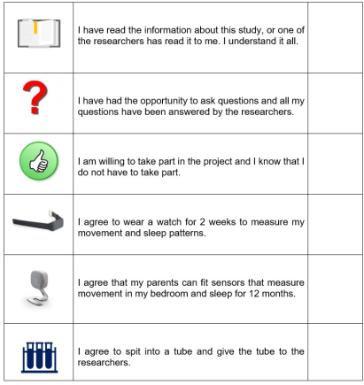

```{r logo,fig.align='center', echo=FALSE}
knitr::include_graphics("images/logo_questionnaire_hi.png")
```

<br><br> <!-- Add two line breaks -->

##  Assent Form for Children 
&nbsp;
If you agree to take part in this research study, please read, tick and sign below.
&nbsp;




