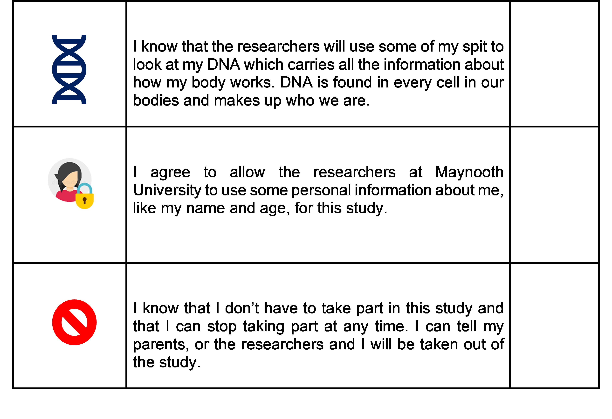

```{r logo,fig.align='center', echo=FALSE}
knitr::include_graphics("images/logo_questionnaire_hi.png")
```

<br><br> <!-- Add two line breaks -->

##  Assent Form for Children (Comparison Families)
&nbsp;
If you agree to take part in this research study, please read, tick and sign below.
&nbsp;

```{r page1,fig.align='center', fig.width=20,echo=FALSE,out.width="87%"}

```


```{r page2,fig.align='center', fig.width=20,echo=FALSE, out.width="87%"}

```

&nbsp;

Child’s Name (Printed):……………………………………….…………………………  
Child’s Signature:…………………………………………………………………………………  

If your child cannot sign their name for any reason, they can tick/mark the following box to indicate they assent to taking part in this study:    
<input type="checkbox">

Parent’s Name (Printed):……………………………………….…………………………  
Parent’s Signature:…………………………………………………………………………………  
Date:……………….………………………………………………………………………………………………………………… 


