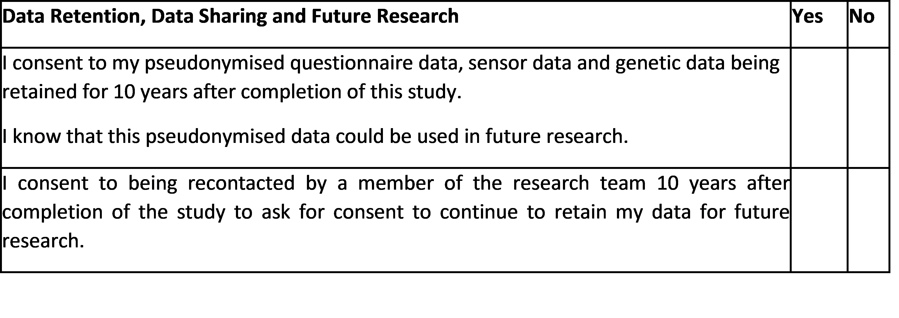
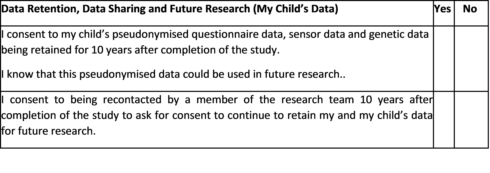
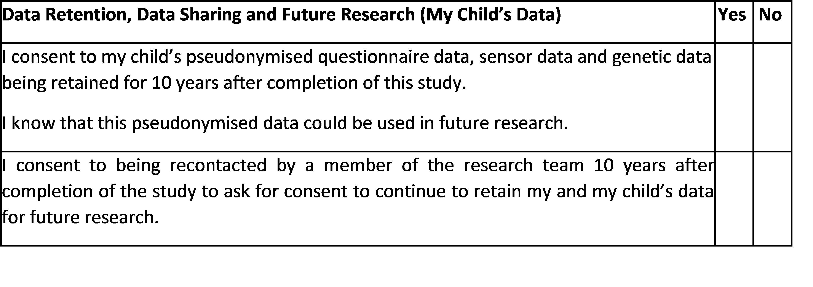

```{r setup, include=FALSE}
knitr::opts_chunk$set(echo = TRUE)
```


```{r logo, echo=FALSE}
knitr::include_graphics("images/logo_questionnaire_hi.png")
```

<br><br> <!-- Add two line breaks -->

##  Sample Consent Form for Adult Participants

It must be recognised that, in some circumstances, confidentiality of research data and records may be overridden by courts in the event of litigation or in the course of investigation by lawful authority. In such circumstances the University will take all reasonable steps within law to ensure that confidentiality is maintained to the greatest possible extent.

If you agree to your participation in this research study, please complete the consent form below.

```{r page1,fig.align='center', fig.width=20,echo=FALSE, out.width="80%"}

```

```{r page2,fig.align='center', fig.width=20,echo=FALSE, out.width="80%"}

```

```{r page3,fig.align='center', fig.width=20,echo=FALSE, out.width="80%"}

```

&nbsp;  

Participant’s Name (Printed):……………………………………….…………………………  
Participant’s Signature:…………………………………………………………………………………  
Date:……………….………………………………………………………………………………………………………………… 

&nbsp;

##  Sample Consent Form for Parents of an Autistic Child

It must be recognised that, in some circumstances, confidentiality of research data and records may be overridden by courts in the event of litigation or in the course of investigation by lawful authority. In such circumstances the University will take all reasonable steps within law to ensure that confidentiality is maintained to the greatest possible extent.

If you agree to your child’s participation in this research study, please complete the consent form below.

```{r page4,fig.align='center', fig.width=20,echo=FALSE, out.width="80%"}

```

```{r page5,fig.align='center', fig.width=20,echo=FALSE, out.width="80%"}

```

```{r page6,fig.align='center', fig.width=20,echo=FALSE, out.width="80%"}

```

&nbsp;  

Parent’s Name (Printed):……………………………………….…………………………  
Parent’s Signature:…………………………………………………………………………………  
Date:……………….………………………………………………………………………………………………………………… 

&nbsp;

##  Sample Consent Form for Parents of a Non-Autistic Child (Families with an Autistic Child)

It must be recognised that, in some circumstances, confidentiality of research data and records may be overridden by courts in the event of litigation or in the course of investigation by lawful authority. In such circumstances the University will take all reasonable steps within law to ensure that confidentiality is maintained to the greatest possible extent.

If you agree to your child’s participation in this research study, please complete the consent form below.

```{r page7,fig.align='center', fig.width=20,echo=FALSE, out.width="80%"}

```

```{r page8,fig.align='center', fig.width=20,echo=FALSE, out.width="80%"}

```

```{r page9,fig.align='center', fig.width=20,echo=FALSE, out.width="80%"}

```

&nbsp;  

Parent’s Name (Printed):……………………………………….…………………………  
Parent’s Signature:…………………………………………………………………………………  
Date:……………….………………………………………………………………………………………………………………… 