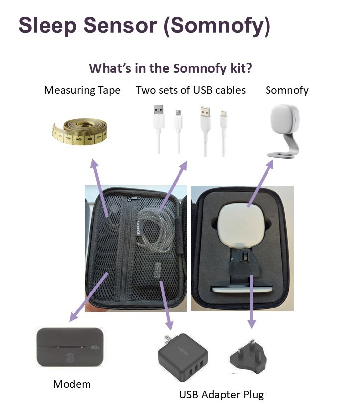
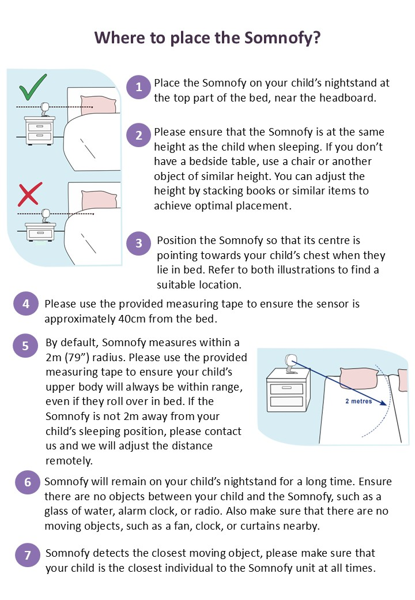
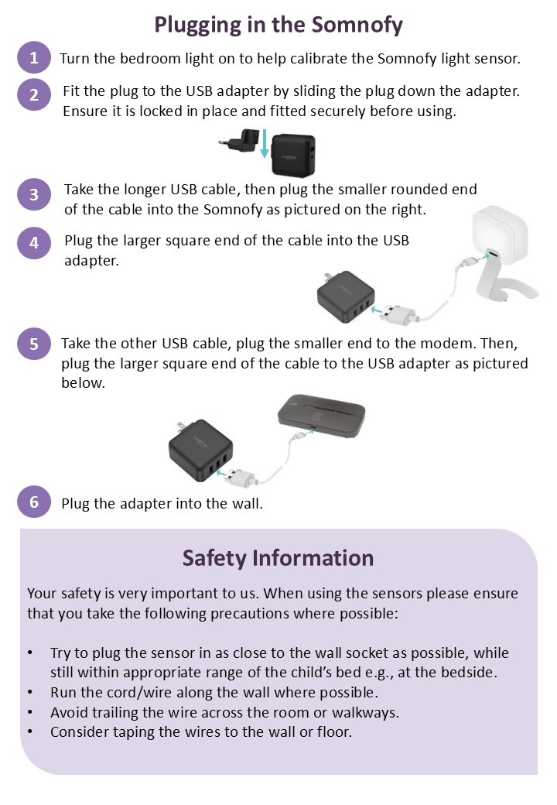
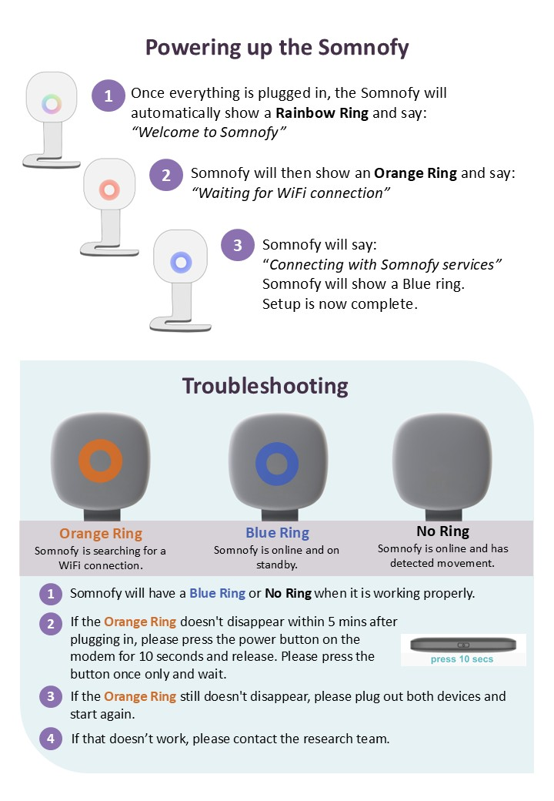
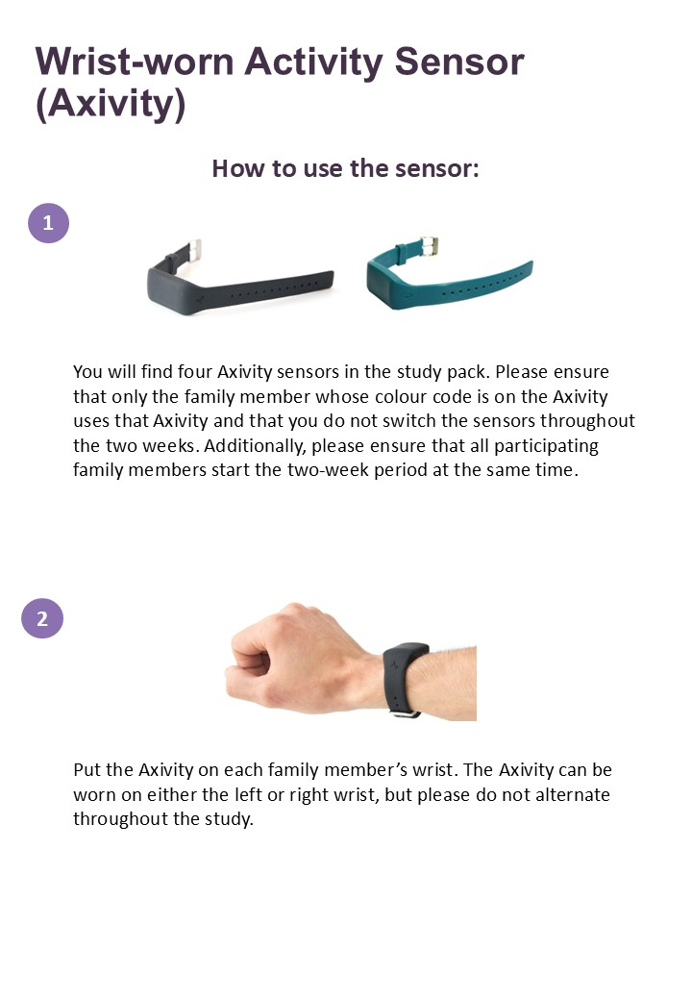
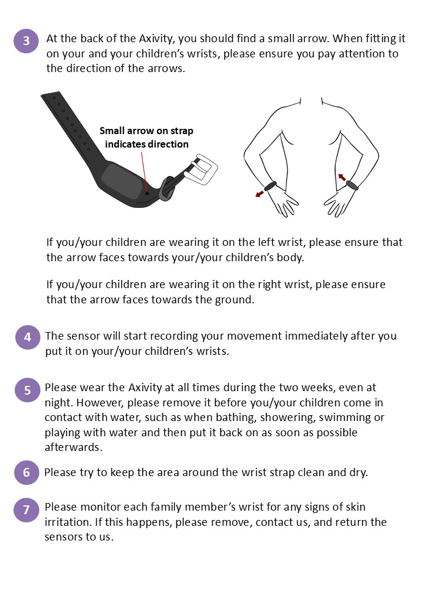

```{r setup, include=FALSE}
knitr::opts_chunk$set(echo = TRUE)
```


```{r logo,fig.align='center', echo=FALSE}
knitr::include_graphics("images/logo_questionnaire_hi.png")
```

<br><br> <!-- Add two line breaks -->

##  Instructions for Wrist-Worn Activity Monitor and Remote Monitoring Sensors
&nbsp;

###  Introduction
As part of the FamilySleeps study, you will be sent two types of sensors. The first is a bedside sleep sensor (Somnofy) that will measure sleep and the sleep environment in one of your children’s bedroom. The second is the wrist-worn activity monitor (Axivity) that you and your family will wear on your wrists. This page contains details on how to set up these two sensors. When you are setting them up, if you have any problems or questions, please feel free to contact us at family.sleeps@mu.ie or 086 164 5998.
&nbsp;

```{r somnofy_case, fig.align='center',echo=FALSE}

```

```{r somnofy_cable1, fig.align='center',echo=FALSE}

```

```{r somnofy_cable2, fig.align='center',echo=FALSE}

```

```{r somnofy_cable3, fig.align='center',echo=FALSE}

```

```{r wrist_worn1, fig.align='center',echo=FALSE}

```

```{r wrist_worn2, fig.align='center',echo=FALSE}

```

